# 🍔 QSR Real-Time Data Platform

**Unified Batch + Streaming Data Engineering Pipeline (Production-Ready)**


This project implements a **cloud-native, self-healing, real-time analytics platform** for Quick Service Restaurants (QSR).  
It simulates a real Point-of-Sale system, streams data into AWS, processes it in real time, and visualizes metrics such as **live revenue**, **orders per minute**, and **store performance**.

The architecture combines **Microservices → Kinesis → Firehose → S3 → Glue → Athena → Grafana** with strong data quality, automation, and cost optimization.

---

# 🏗️ Architecture Overview

## 🔌 Core Components

### 1️⃣ Source System (Microservice)
- **Tech:** Python, Flask, Faker  
- **Purpose:** Generates realistic POS order events  
- **Automation:** Auto-start via **systemd**  
- **Feature:** Randomized restaurants, amounts, timestamps  

---

### 2️⃣ Ingestion Layer (Producer + Airflow)
- **Tech:** Python, Airflow  
- **Purpose:** Polling Producer sends events to AWS  
- **Feature:** Dynamic Service Discovery using AWS SDK  

---

### 3️⃣ Streaming + Storage
- **Amazon Kinesis**  
- **Amazon Firehose**  
- **Amazon S3** (Raw + Clean Data Lake)  

---

### 4️⃣ Transformation & Quality
- **AWS Glue (PySpark)**  
- **Great Expectations**  
- **Airflow Orchestration**  

---

### 5️⃣ Analytics Layer
- **Glue Crawler**  
- **Amazon Athena**  
- **Grafana Dashboards**

---

# 🧱 Repository Structure

```
dags/       → Airflow DAGs
src/        → Microservice + producers + validators
data/       → Sample CSVs
infra/      → Terraform IaC
README.md   → Documentation
```

---

# 🗺️ Architecture Diagram

```mermaid
flowchart TB

subgraph API["🍟 Microservice API"]
A1[Flask POS API]
end

subgraph PRODUCER["📡 Producer (Python + Airflow)"]
A2[Dynamic IP Discovery<br>Auto-Retry Logic]
end

API -->|REST JSON Events| PRODUCER

subgraph STREAM["⚡ Real-time Streaming"]
B1[Kinesis Stream]
B2[Firehose Delivery Stream]
end

PRODUCER --> B1 --> B2 --> S3_RAW[(S3 Raw Zone)]

subgraph QUALITY["🛡️ Data Quality"]
Q1[Great Expectations]
end

S3_RAW --> Q1

subgraph ETL["🧪 ETL / Processing"]
G1[AWS Glue PySpark Job]
end

Q1 -->|PASS| G1 --> S3_CLEAN[(S3 Clean Zone / Parquet)]
Q1 -->|FAIL| STOP[[❌ Stop Pipeline + Alert]]

S3_CLEAN --> CRAWLER[AWS Glue Crawler] --> ATHENA[Athena SQL Engine]

ATHENA --> GRAFANA[📊 Grafana Dashboard]
```



---

# 🚀 Daily Workflow (How You Run the Platform)

## 1. Wake Up the Cloud ☀️

```bash
cd infra
terraform apply
```

Start two EC2 instances:
- Airflow
- POS API

---

## 2. Auto-Pilot Mode 🤖

- **systemd** auto-starts:
  - Microservice
  - Airflow Webserver & Scheduler  
- Producers auto-detect new Private/Public IPs  
- Data begins flowing instantly  

---

## 3. Verify & Visualize 📊

### Grafana  
```
http://<AIRFLOW_IP>:3000
```

### Airflow  
```
http://<AIRFLOW_IP>:8080
```

---

## 4. Update Athena Catalog  
Run crawler:
```
qsr-clean-data-crawler
```

---

# 🛑 Shutdown Protocol (Cost Saving)

### Stop EC2 Instances  
### Destroy Streaming Layer

```bash
terraform destroy   -target="aws_kinesis_stream.order_stream"   -target="aws_kinesis_firehose_delivery_stream.s3_stream"
```

---

# 🧪 Data Quality Rules (Great Expectations)

| Expectation | Rule |
|------------|------|
| Completeness | `order_id` cannot be NULL |
| Integrity | `amount` > 0 |
| Enum Check | restaurant names valid |
| Type Check | timestamp → ISO 8601 |

---

# 🧬 Medallion Lakehouse

### Bronze  
- Raw API + Stream dumps  

### Silver  
- Cleaned, validated, Parquet  

### Gold  
- Athena tables for dashboards  

---

# 📈 Example Athena Query

```sql
SELECT store_id,
       COUNT(*) AS total_orders,
       SUM(amount) AS revenue,
       AVG(amount) AS avg_ticket
FROM qsr_clean.orders
GROUP BY store_id
ORDER BY revenue DESC;
```

---

# 🧑‍🏫 Interview Talking Points

You can now explain:

- Microservices → Streaming → Lakehouse  
- Real-time ingestion  
- Dynamic IP discovery  
- systemd automation  
- Airflow orchestration  
- Glue ETL with PySpark  
- Cost optimization design  
- Grafana dashboards  

This is a strong **end-to-end Data Engineering project**.

