# 🍔 QSR Real-Time Analytics Platform

**Unified Batch + Real-Time Data Engineering Pipeline (Production-Ready)**


A highly scalable **real-time + batch analytics platform** designed for Quick Service Restaurants (QSR).
It ingests raw data from CSV uploads and streaming POS events, validates it with **Great Expectations**, processes it using **PySpark** in AWS Glue, and organizes the data into a structured **Medallion Architecture** (Bronze → Silver → Gold) stored in S3 and queried using Athena.
 
---

**Repository layout**

- `dags/`: Airflow DAGs (moved `01_sensor_dag.py`, `02_end_to_end.py`, `03_process_stream.py`).
- `src/`: Core Python scripts (moved `etl_script.py`, `producer.py`, `validate_orders.py`).
- `data/`: Sample and test data (moved `orders.csv`, `bad_orders.csv`).
- `infra/`: Terraform files and backups (moved `main.tf` and `terraform*` backups).
- `README.md`: This file (updated to reflect layout).

---
---

# 🏛️ Architecture 

```mermaid
flowchart TB
    %% ============================
    %% STYLES
    %% ============================
    classDef bronze fill:#f5deb3,stroke:#b8860b,stroke-width:2px,color:#000;
    classDef silver fill:#e6e8eb,stroke:#a6a6a6,stroke-width:2px,color:#000;
    classDef gold fill:#fff4b3,stroke:#ccad00,stroke-width:2px,color:#000;
    classDef sys fill:#d6eaff,stroke:#3399ff,stroke-width:1.5px,color:#000;
    classDef quality fill:#e8f6ff,stroke:#006699,stroke-width:1.5px,color:#000;

    %% ============================
    %% INGESTION → BRONZE LAYER
    %% ============================
    subgraph BRONZE["🟫 BRONZE LAYER — Raw Ingestion"]
        A1([📄 Batch Source<br/>CSV Uploads]):::bronze --> A2[(🪣 S3 /raw)]:::bronze

        A3([⚡ Streaming Source<br/>Python Producer]):::bronze -->|~0.5s events| A4([Kinesis Stream]):::bronze
        A4 -->|Firehose Delivery| A5[(🪣 S3 /raw_stream)]:::bronze
    end

    %% ============================
    %% ORCHESTRATION + QUALITY
    %% ============================
    subgraph ORCH["🌀 Orchestration & Quality"]
        O1{{Airflow DAGs}}:::sys
        Q1([🛡️ Great Expectations<br/>Data Quality Gate]):::quality
    end

    %% Airflow paths
    O1 -->|Watches for file| A2
    O1 -->|Schedules stream runs| A5
    O1 -->|Triggers Validation| Q1

    %% Validation decision
    Q1 -->|PASS| S1
    Q1 -->|FAIL| ERR([❌ Stop Pipeline<br/>Send Alert]):::quality

    %% ============================
    %% SILVER LAYER
    %% ============================
    subgraph SILVER["⚪ SILVER LAYER — Clean, Validated Data"]
        S1([AWS Glue Job<br/>PySpark Transformation]):::silver --> S2[(🪣 S3 /clean<br/>Partitioned Parquet)]:::silver
    end

    %% ============================
    %% GOLD LAYER
    %% ============================
    subgraph GOLD["🟨 GOLD LAYER — Analytics & Consumption"]
        G1([AWS Glue Crawler]):::gold --> G2([Athena SQL Engine]):::gold
    end

    %% Flow from Silver → Gold
    S2 --> G1
```



---

# ⭐ Key Features

### **1. Full Medallion Architecture (Bronze → Silver → Gold)**

| Layer      | Purpose                           | Your Implementation                          |
| ---------- | --------------------------------- | -------------------------------------------- |
| **Bronze** | Raw ingestion, no transformations | S3 `/raw` & `/raw_stream`                    |
| **Silver** | Cleaned, validated, structured    | PySpark → S3 `/clean` (Parquet + partitions) |
| **Gold**   | Analytics-ready                   | Glue Catalog → Athena                        |

---

### **2. Hybrid Ingestion (Batch + Streaming)**

* **Batch**: CSV uploaded to S3 triggers Airflow DAG
* **Streaming**: Python producer → Kinesis → Firehose → S3
* Both merge into **one unified analytical dataset**

---

### **3. Strong Data Quality Enforcement (Great Expectations)**

Pipeline validates incoming data before transformation:

* Completeness → No null `order_id`
* Validity → `amount` > 0
* Consistency → `city` within allowed list

If validation fails → **Pipeline stops + Alerts**.

---

### **4. Cost-Optimized Architecture**

* Public subnets = no NAT Gateway (saves ~$32/mo)
* Temporary streaming layer (destroy when not used)
* Serverless Glue & Athena → pay only for execution

---

# 🛠️ Tech Stack

### **Infrastructure**

* Terraform (VPC, EC2, IAM, S3, Glue, Kinesis)

### **Orchestration**

* Apache Airflow 2.9 on Ubuntu EC2

### **Processing**

* AWS Glue 4.0 (PySpark 3)

### **Quality**

* Great Expectations

### **Analytics**

* Glue Crawler
* Athena SQL Engine

---

# 🚀 Deployment Guide

## **1. Deploy Infrastructure**

```bash
terraform init
terraform apply
```

Capture output values:

* S3 bucket
* EC2 public IP

---

## **2. Configure Airflow**

SSH into EC2:

```bash
ssh -i qsr-key.pem ubuntu@<EC2_PUBLIC_IP>
```

Install Airflow + dependencies:

```bash
sudo apt-get update && sudo apt-get install -y python3-pip python3-venv
python3 -m venv airflow_venv && source airflow_venv/bin/activate

pip install "apache-airflow==2.9.2" apache-airflow-providers-amazon --constraint "https://raw.githubusercontent.com/apache/airflow/constraints-2.9.2/constraints-3.12.txt"
pip install great_expectations pandas boto3

airflow db migrate
airflow users create --username admin --firstname Admin --lastname User --role Admin --email admin@example.com --password admin

airflow webserver --port 8080 -D
airflow scheduler -D
```

---

## **3. Deploy DAGs**

```bash
sed -i 's/OLD_BUCKET/NEW_BUCKET/g' *.py
scp -i qsr-key.pem *.py ubuntu@<EC2_PUBLIC_IP>:~/airflow/dags/
```

---

# 🎮 Running the Platform

## **Batch Pipeline**

1. Upload `orders.csv` → S3 `/raw/`
2. Airflow detects → GE validates → Glue processes → Parquet in `/clean/`

🎯 **Failing validation stops the pipeline gracefully.**

---

## **Streaming Pipeline**

Start producer:

```bash
python producer.py
```

Flow → Producer → Kinesis → Firehose → S3 → Airflow → Glue → Parquet

---

# 💰 Cost Management (Run in Portfolio Mode)

### **1. Destroy Kinesis resources**

```bash
terraform destroy \
  -target="aws_kinesis_stream.order_stream" \
  -target="aws_kinesis_firehose_delivery_stream.s3_stream"
```

### **2. Stop EC2 instance**

Keeps project functional but costs only **~$0.03/day** for EBS.

---

# 📈 Athena Query Example

```sql
SELECT 
    input_source, 
    COUNT(*) AS total_orders, 
    SUM(amount) AS revenue,
    AVG(amount) AS avg_ticket_size
FROM qsr_analytics_db.clean
GROUP BY input_source;
```

---

# 🧑‍🏫 Final Note for Interviews

This README demonstrates that you understand:

* Designing ingestion pipelines
* Implementing Medallion Architecture
* Setting up quality gates
* Using Airflow orchestration
* Leveraging AWS Glue & Athena
* Cost optimization
* Building a real analytics-ready platform


